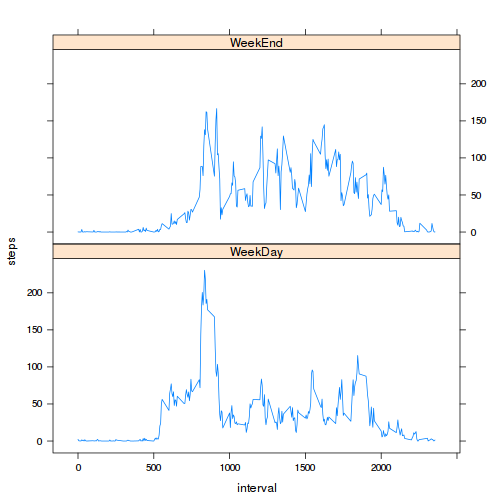

# Reproducible Research: Peer Assessment 1

## Loading and preprocessing the data

```r
library(plyr)
library(data.table)
library(lubridate)
data <- fread("activity.csv", colClasses=c("numeric","factor","integer"))
data$date <- ymd(data$date)
```
## What is mean total number of steps taken per day?

```r
total_steps <- tapply(data$steps, data$date, sum)
hist(total_steps, xlab = "Total steps per day", main = "Histogram of the total number of steps taken each day")
```

 

```r
# mean and median total number of steps taken per day
mean(total_steps, na.rm = T)
```

```
## [1] 10766
```

```r
median(total_steps, na.rm = T)
```

```
## [1] 10765
```
## What is the average daily activity pattern?

```r
head(data[, avg := mean(steps, na.rm = T), by = interval], 5)
```

```
##    steps       date interval     avg
## 1:    NA 2012-10-01        0 1.71698
## 2:    NA 2012-10-01        5 0.33962
## 3:    NA 2012-10-01       10 0.13208
## 4:    NA 2012-10-01       15 0.15094
## 5:    NA 2012-10-01       20 0.07547
```

```r
plot(avg ~ interval, data, type = "l", xlab = "Intervals", ylab = "Average number of steps")
```

 

```r
# Which 5-minute interval, on average across all the days in the dataset, contains the maximum number of steps?
arrange(data[ ,avg,interval], desc(avg))[1]
```

```
##    interval   avg
## 1:      835 206.2
```
## Imputing missing values

```r
#  missing values
sum(is.na(data))
```

```
## [1] 2304
```

```r
# Imputing NA's with average on 5-min interval and create new dataset
head(data[is.na(steps), steps := avg], 5)
```

```
##      steps       date interval     avg
## 1: 1.71698 2012-10-01        0 1.71698
## 2: 0.33962 2012-10-01        5 0.33962
## 3: 0.13208 2012-10-01       10 0.13208
## 4: 0.15094 2012-10-01       15 0.15094
## 5: 0.07547 2012-10-01       20 0.07547
```

```r
daily_steps <- tapply(data$steps, data$date, sum)
# plot the histogram
hist(daily_steps, xlab = "Total steps per day", main = "Histogram of the total number of steps per day")
```

 

```r
# mean and median total number of steps taken per day don't change significantly
mean(daily_steps)
```

```
## [1] 10766
```

```r
median(daily_steps)
```

```
## [1] 10766
```

```r
# difference between mean and median from the first and this assignment
abs(mean(daily_steps) - mean(total_steps, na.rm = T))
```

```
## [1] 0
```

```r
abs(median(daily_steps) - median(total_steps, na.rm = T))
```

```
## [1] 1.189
```
Mean values didn't change as imputation and median change slightly.
Imputation change the apperance of histogram. The intervals between
10000-15000 are more frequent.

## Are there differences in activity patterns between weekdays and weekends?

```r
library(lattice)
# change local time
Sys.setlocale("LC_TIME", "C")
```

```
## [1] "C"
```

```r
# change date to weekdays
head(data[, date := weekdays(date, abbreviate = T)], 5)
```

```
##      steps date interval     avg
## 1: 1.71698  Mon        0 1.71698
## 2: 0.33962  Mon        5 0.33962
## 3: 0.13208  Mon       10 0.13208
## 4: 0.15094  Mon       15 0.15094
## 5: 0.07547  Mon       20 0.07547
```

```r
# create string column week with two variable "weekend" and "weekday" by ifelse condition
head(data[, date := ifelse(date %in% c("Sat", "Sun"), "WeekEnd", "WeekDay")], 5)
```

```
##      steps    date interval     avg
## 1: 1.71698 WeekDay        0 1.71698
## 2: 0.33962 WeekDay        5 0.33962
## 3: 0.13208 WeekDay       10 0.13208
## 4: 0.15094 WeekDay       15 0.15094
## 5: 0.07547 WeekDay       20 0.07547
```

```r
week <- ddply(data, .(interval, date), summarize, steps = mean(steps))
xyplot(steps ~ interval | date, week, layout = c(1, 2), type = "l")
```

 
