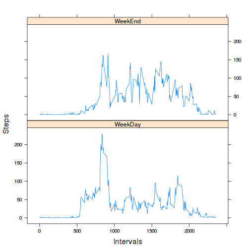

# Reproducible Research: Peer Assessment 1

## Loading and preprocessing the data

```r
library(plyr)
library(lubridate)
data <- read.csv("activity.csv")
data$date <- ymd(data$date)
```
## What is mean total number of steps taken per day?

```r
total_steps <- tapply(data$steps, data$date, sum)
hist(total_steps, xlab = "Total steps per day", main = "Histogram of the total number of steps taken each day")
```

 

```r
# mean and median total number of steps taken per day
mean(total_steps, na.rm = T)
```

```
## [1] 10766
```

```r
median(total_steps, na.rm = T)
```

```
## [1] 10765
```
## What is the average daily activity pattern?

```r
inter_steps <- ddply(data, .(interval), summarize, avg = mean(steps, na.rm = T))
plot(inter_steps$avg ~ inter_steps$interval, type = "l", xlab = "Intervals", ylab = "Average number of steps")
```

 

```r
# Which 5-minute interval, on average across all the days in the dataset, contains the maximum number of steps?
inter_steps$interval[which.max(inter_steps$avg)]
```

```
## [1] 835
```
## Imputing missing values

```r
#  missing values
sum(is.na(data))
```

```
## [1] 2304
```

```r
# Imputing NA's with average on 5-min interval and create new dataset
NA_values <- which(is.na(data$steps))
new_data <- join(data, inter_steps)
```

```
## Joining by: interval
```

```r
new_data$steps[NA_values] <- new_data$avg[NA_values]
daily_steps <- tapply(new_data$steps, new_data$date, sum)

# plot the histogram
hist(daily_steps, xlab = "Total steps per day", main = "Histogram of the total number of steps per day")
```

 

```r
# mean and median total number of steps taken per day don't change significantly
mean(daily_steps)
```

```
## [1] 10766
```

```r
median(daily_steps)
```

```
## [1] 10766
```

```r
# difference between mean and median from the first and this assignment
abs(mean(daily_steps) - mean(total_steps, na.rm = T))
```

```
## [1] 0
```

```r
abs(median(daily_steps) - median(total_steps, na.rm = T))
```

```
## [1] 1.189
```
Mean values didn't change as imputation and median change slightly.
Imputation change the apperance of histogram. The intervals between
10000-15000 are more frequent.

## Are there differences in activity patterns between weekdays and weekends?

```r
library(lattice)
# change date to weekdays
new_data$date <- wday(new_data$date, label = T)
# create string column week with two variable "weekend" and "weekday" by ifelse condition
new_data$week<- ifelse(new_data$date %in% c("Sat", "Sun"), "weekend", "weekday")
week_avg <- ddply(new_data, .(interval, week), summarize, steps = mean(steps))
xyplot(steps ~ interval | week, data = week_avg, layout = c(1, 2), type = "l")
```

 
